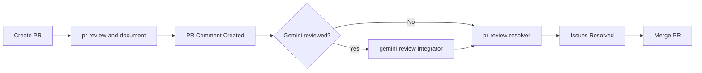

# PR Review Toolkit

A Claude Code plugin for comprehensive PR review workflow: execute reviews, integrate Gemini suggestions, and interactively resolve issues.

## Features

| Skill | Description |
|-------|-------------|
| **pr-review-and-document** | Execute comprehensive PR review using opus model and post structured results as a PR comment |
| **gemini-review-integrator** | Integrate Gemini Code Assist suggestions into the existing PR review comment |
| **pr-review-resolver** | Interactively resolve PR review issues one by one (繁體中文) |

## Prerequisites

- **GitHub CLI** (`gh`) - authenticated and configured
- **pr-review-toolkit plugin (official)** - The agents used by pr-review-and-document skill

Install the official pr-review-toolkit plugin first:
```bash
# In Claude Code
/plugin marketplace add claude-plugins-official
/plugin install pr-review-toolkit
```

## Installation

### From Source

```bash
# Clone the repository
git clone https://github.com/your-org/pr-review-toolkit.git

# In Claude Code, add the plugin
claude --plugin-dir /path/to/pr-review-toolkit
```

### From Marketplace (when published)

```bash
/plugin marketplace add your-marketplace
/plugin install pr-review-toolkit
```

## Usage

### PR Review and Document

Run a comprehensive PR review and post it as a comment:

```
Please review this PR and document the results
```

Or more specifically:
- "review PR and save results"
- "run PR review with documentation"
- "create PR review document"

### Gemini Review Integrator

After Gemini Code Assist has reviewed your PR, integrate its suggestions:

```
Integrate Gemini review into the PR comment
```

Or:
- "merge Gemini suggestions"
- "add Gemini comments to PR review"
- "sync Gemini code assist"

### PR Review Resolver

Interactively resolve issues from the PR review comment:

```
處理 PR review 問題
```

Or:
- "修復 review 項目"
- "解決 PR 回饋"
- "逐一處理 review issues"
- "run pr review resolver"

## Workflow



## PR Comment Structure

The PR review comment includes:

- **Metadata block**: Hidden JSON for tracking review state
- **Summary table**: Issue counts by category (Critical, Important, Suggestions)
- **Issue details**: Collapsible sections with file references and fixes
- **Type design ratings**: Quality scores for new types
- **Action plan**: Before-merge and after-merge checklists

## Status Indicators

| Indicator | Meaning |
|-----------|---------|
| ✅ | Fixed / Resolved |
| ⏭️ | Deferred / Skipped intentionally |
| ⚠️ | Needs attention |
| 🔴 | Blocking / Critical |

## Scripts

The plugin includes shared scripts in `scripts/`:

| Script | Purpose |
|--------|---------|
| `find-review-comment.sh` | Find existing PR review comment by metadata marker |
| `upsert-review-comment.sh` | Create or update PR review comment |
| `fetch-gemini-comments.sh` | Fetch and parse Gemini Code Assist comments |

## License

MIT
