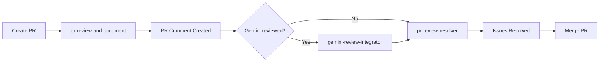

# PR Review Toolkit

[](https://github.com/marxbiotech/pr-review-toolkit/releases)
[](LICENSE)

A Claude Code plugin for comprehensive PR review workflow: execute reviews, integrate Gemini suggestions, and interactively resolve issues.

> **Latest:** See [CHANGELOG.md](CHANGELOG.md) for release notes | [Releases](https://github.com/marxbiotech/pr-review-toolkit/releases) for downloads

## Features

| Skill | Description |
|-------|-------------|
| **pr-review-and-document** | Execute comprehensive PR review using opus model and post structured results as a PR comment |
| **gemini-review-integrator** | Integrate Gemini Code Assist suggestions into the existing PR review comment |
| **pr-review-resolver** | Interactively resolve PR review issues one by one (繁體中文) |

## Prerequisites

- **GitHub CLI** (`gh`) - authenticated and configured
- **pr-review-toolkit plugin (official)** - The agents used by pr-review-and-document skill

Install the official pr-review-toolkit plugin first:
```bash
# In Claude Code
/plugin marketplace add claude-plugins-official
/plugin install pr-review-toolkit
```

## Installation

### From Marketplace (Recommended)

In Claude Code:
```
/plugin marketplace add marxbiotech/pr-review-toolkit
/plugin install pr-review-toolkit
```

### From Source

```bash
# Clone the repository
git clone https://github.com/marxbiotech/pr-review-toolkit.git

# In Claude Code, add the plugin
claude --plugin-dir /path/to/pr-review-toolkit
```

### Codex Skills (From Source)

This repository also includes Codex skill definitions under `codex/skills/`:

| Skill | Description |
|-------|-------------|
| **codex-review-pass** | Run a Codex PR review pass and create or update the canonical PR review comment |
| **codex-fix-worker** | Fix one selected PR review issue and update that issue's status |

<!-- Design Decision: deliberate hand-wavy install instruction.
     The Codex marketplace metadata format and canonical install location are not yet finalized,
     so this README intentionally avoids prescribing a concrete path (e.g., ~/.codex/skills/) that
     could become wrong as Codex packaging stabilizes. Once marketplace metadata is published,
     replace the hand-wavy sentence below with explicit cp/ln commands and a target path. -->
Until Codex marketplace metadata is finalized, install from source by making these skill directories available to Codex and setting the toolkit root:

```bash
export PR_REVIEW_TOOLKIT_ROOT=/path/to/pr-review-toolkit
```

Both Codex skills use `.pr-review-cache/pr-{N}.json` as the only review state contract and write through the shared `scripts/cache-*.sh` helpers.

## Usage

### PR Review and Document

Run a comprehensive PR review and post it as a comment:

```
Please review this PR and document the results
```

Or more specifically:
- "review PR and save results"
- "run PR review with documentation"
- "create PR review document"

### Gemini Review Integrator

After Gemini Code Assist has reviewed your PR, integrate its suggestions:

```
Integrate Gemini review into the PR comment
```

Or:
- "merge Gemini suggestions"
- "add Gemini comments to PR review"
- "sync Gemini code assist"

### PR Review Resolver

Interactively resolve issues from the PR review comment:

```
處理 PR review 問題
```

Or:
- "修復 review 項目"
- "解決 PR 回饋"
- "逐一處理 review issues"
- "run pr review resolver"

## Workflow


```mermaid
graph LR
    A[Create PR] --> B[pr-review-and-document]
    B --> C[PR Comment Created]
    C --> D{Gemini reviewed?}
    D -->|Yes| E[gemini-review-integrator]
    D -->|No| F[pr-review-resolver]
    E --> F
    F --> G[Issues Resolved]
    G --> H[Merge PR]
```

## PR Comment Structure

The PR review comment includes:

- **Metadata block**: Hidden JSON for tracking review state
- **Summary table**: Issue counts by category (Critical, Important, Suggestions)
- **Issue details**: Collapsible sections with file references and fixes
- **Type design ratings**: Quality scores for new types
- **Action plan**: Before-merge and after-merge checklists

## Status Indicators

| Indicator | Meaning |
|-----------|---------|
| ✅ | Fixed / Resolved |
| ⏭️ | Deferred / Skipped intentionally |
| ⚠️ | Needs attention |
| 🔴 | Blocking / Critical |

## Scripts

The plugin includes shared scripts in `scripts/`:

| Script | Purpose |
|--------|---------|
| `find-review-comment.sh` | Find existing PR review comment by metadata marker |
| `upsert-review-comment.sh` | Create or update PR review comment |
| `fetch-gemini-comments.sh` | Fetch and parse Gemini Code Assist comments |
| `review-metadata-upgrade.sh` | Normalize PR review metadata to schema 1.1 |
| `review-metadata-replace.sh` | Replace the hidden metadata block without changing issue sections |

## License

MIT
