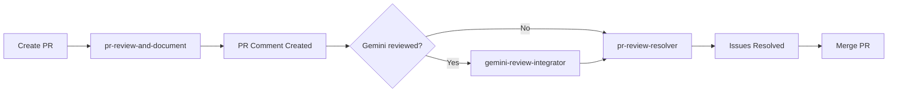
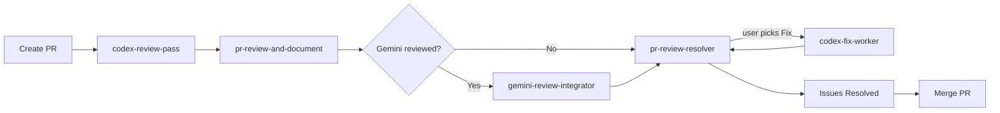

# PR Review Toolkit

[](https://github.com/marxbiotech/pr-review-toolkit/releases)
[](LICENSE)

A Claude Code plugin for comprehensive PR review workflow: execute reviews, integrate Gemini suggestions, and interactively resolve issues.

> **Latest:** See [CHANGELOG.md](CHANGELOG.md) for release notes | [Releases](https://github.com/marxbiotech/pr-review-toolkit/releases) for downloads

## Features

| Skill | Description |
|-------|-------------|
| **pr-review-and-document** | Execute comprehensive PR review using opus model and post structured results as a PR comment |
| **gemini-review-integrator** | Integrate Gemini Code Assist suggestions into the existing PR review comment |
| **pr-review-resolver** | Interactively resolve PR review issues one by one (繁體中文) |

## Prerequisites

- **GitHub CLI** (`gh`) - authenticated and configured
- **pr-review-toolkit plugin (official)** - The agents used by pr-review-and-document skill

Install the official pr-review-toolkit plugin first:
```bash
# In Claude Code
/plugin marketplace add claude-plugins-official
/plugin install pr-review-toolkit
```

## Installation

### From Marketplace (Recommended)

In Claude Code:
```
/plugin marketplace add marxbiotech/pr-review-toolkit
/plugin install pr-review-toolkit
```

### From Source

```bash
# Clone the repository
git clone https://github.com/marxbiotech/pr-review-toolkit.git

# In Claude Code, add the plugin
claude --plugin-dir /path/to/pr-review-toolkit
```

### Codex Plugin / Skills (From Source)

This repository also includes a repo-scoped Codex marketplace at `.agents/plugins/marketplace.json`, a Codex plugin packaged under `plugins/pr-review-toolkit/` (with manifest at `plugins/pr-review-toolkit/.codex-plugin/plugin.json`, skill definitions under `plugins/pr-review-toolkit/codex/skills/`, and the helper scripts under `plugins/pr-review-toolkit/scripts/`):

| Skill | Description |
|-------|-------------|
| **codex-review-pass** | Run six read-only Codex review subagents in parallel and return one deduplicated review bundle |
| **pr-review-and-document** | Publish the Codex review bundle to the canonical PR review comment and `.pr-review-cache/pr-{N}.json` |
| **gemini-review-integrator** | Integrate Gemini Code Assist inline comments into the canonical PR review comment |
| **pr-review-resolver** | Interactively resolve unresolved PR review findings one by one in Traditional Chinese and coordinate fix decisions |
| **codex-fix-worker** | Resolver-managed worker that fixes one selected issue with bounded owned files and reports validation results |

Until public Codex marketplace distribution is finalized, install from source by cloning the repository and registering it as a local plugin marketplace in Codex. The current [Codex plugin docs](https://developers.openai.com/codex/plugins/build?install-scope=workspace) describe `codex plugin marketplace add .` for this workspace-scoped flow; run `codex plugin --help` against your installed version if the CLI has changed. The marketplace entry points at the packaged plugin directory (`"./plugins/pr-review-toolkit"`), and the manifest there points Codex at `./codex/skills/` (relative to that plugin root), so keep the repository layout intact:

```bash
git clone https://github.com/marxbiotech/pr-review-toolkit.git
cd pr-review-toolkit
jq empty .agents/plugins/marketplace.json plugins/pr-review-toolkit/.codex-plugin/plugin.json
# Then register this directory as a local plugin marketplace using the
# subcommand documented for your Codex version (currently expected to be
# `codex plugin marketplace add .`).
```

Set the toolkit root for Codex sessions that run these skills. For source installs, point it at the packaged plugin root:

```bash
export PR_REVIEW_TOOLKIT_ROOT=/path/to/pr-review-toolkit/plugins/pr-review-toolkit
```

Codex review is split into distinct responsibilities. `codex-review-pass` is read-only: it launches the six review subagents (`code-reviewer`, `code-simplifier`, `silent-failure-hunter`, `type-design-analyzer`, `pr-test-analyzer`, and `comment-analyzer`) and returns a normalized bundle. `pr-review-and-document` owns review publishing and writes that bundle through the shared `${PR_REVIEW_TOOLKIT_ROOT}/scripts/cache-*.sh` helpers. `gemini-review-integrator` merges Gemini Code Assist feedback into that same canonical comment. `pr-review-resolver` is the interactive decision coordinator for unresolved findings and owns all resolver status updates. `codex-fix-worker` is resolver-managed only: it fixes exactly one selected issue with bounded owned files and never writes the review comment/cache directly.

**Recommended persistent command approvals for ACP-driven Codex runs:**

ACP approval matching is a literal prefix match against the command Codex executes. Because the shell expands `${PR_REVIEW_TOOLKIT_ROOT}` before ACP sees the command, approvals must use the expanded absolute path for your packaged plugin root — not the literal `$PR_REVIEW_TOOLKIT_ROOT` string and not a relative path like `./plugins/pr-review-toolkit/scripts/...`. Replace `/path/to/pr-review-toolkit/plugins/pr-review-toolkit` below with the absolute packaged plugin path.

```text
["/path/to/pr-review-toolkit/plugins/pr-review-toolkit/scripts/get-pr-number.sh"]
["/path/to/pr-review-toolkit/plugins/pr-review-toolkit/scripts/cache-read-comment.sh"]
["/path/to/pr-review-toolkit/plugins/pr-review-toolkit/scripts/cache-write-comment.sh"]
["/path/to/pr-review-toolkit/plugins/pr-review-toolkit/scripts/cache-sync.sh"]
["/path/to/pr-review-toolkit/plugins/pr-review-toolkit/scripts/find-review-comment.sh"]
["/path/to/pr-review-toolkit/plugins/pr-review-toolkit/scripts/fetch-gemini-comments.sh"]
["/path/to/pr-review-toolkit/plugins/pr-review-toolkit/scripts/review-metadata-upgrade.sh"]
["/path/to/pr-review-toolkit/plugins/pr-review-toolkit/scripts/review-metadata-replace.sh"]
["gh", "api"]
["gh", "pr"]
["git", "diff"]
["git", "status"]
```

Avoid broader prefixes like `["bash"]` or `["./"]` that would auto-approve unrelated commands.

## Usage

### PR Review and Document

Run a comprehensive PR review and post it as a comment:

```
Please review this PR and document the results
```

Or more specifically:
- "review PR and save results"
- "run PR review with documentation"
- "create PR review document"

### Codex PR Review and Document

Run a Codex review with six parallel read-only review subagents, then publish one canonical PR comment:

```
Run a Codex PR review and document the results
```

For analysis only, without writing the PR comment, ask for:

```
Run a Codex review pass
```

### Codex PR Review Resolver

Resolve existing review findings one by one with Codex. The resolver discusses each unresolved item in Traditional Chinese, asks for a decision, coordinates bounded fix work, and updates the canonical review comment through `.pr-review-cache`:

```
Resolve PR review findings with Codex
```

### Codex Gemini Review Integrator

Integrate Gemini Code Assist inline review comments into the canonical PR review comment:

```
Integrate Gemini review comments with Codex
```

### Gemini Review Integrator

After Gemini Code Assist has reviewed your PR, integrate its suggestions:

```
Integrate Gemini review into the PR comment
```

Or:
- "merge Gemini suggestions"
- "add Gemini comments to PR review"
- "sync Gemini code assist"

### PR Review Resolver

Interactively resolve issues from the PR review comment:

```
處理 PR review 問題
```

Or:
- "修復 review 項目"
- "解決 PR 回饋"
- "逐一處理 review issues"
- "run pr review resolver"

## Workflow

### Claude flow


```mermaid
graph LR
    A[Create PR] --> B[pr-review-and-document]
    B --> C[PR Comment Created]
    C --> D{Gemini reviewed?}
    D -->|Yes| E[gemini-review-integrator]
    D -->|No| F[pr-review-resolver]
    E --> F
    F --> G[Issues Resolved]
    G --> H[Merge PR]
```

### Codex flow

The Codex side splits the same workflow across five skills with a clear producer/publisher/integrator/resolver/worker boundary. The diagram below shows the Codex-first variant (Codex runs the review pass and bootstraps the canonical comment). For the mixed Claude-first → Codex-resolver scenario where Claude's `pr-review-and-document` runs first and Codex participates later, see [`docs/codex-integration-design.md`](docs/codex-integration-design.md).


```mermaid
graph LR
    A[Create PR] --> B[codex-review-pass]
    B --> C[pr-review-and-document]
    C --> D{Gemini reviewed?}
    D -->|Yes| E[gemini-review-integrator]
    D -->|No| F[pr-review-resolver]
    E --> F
    F -->|user picks Fix| G[codex-fix-worker]
    G --> F
    F --> H[Issues Resolved]
    H --> I[Merge PR]
```

- `codex-review-pass` is read-only and returns a normalized review bundle.
- `pr-review-and-document` is the only writer of the canonical PR comment / `.pr-review-cache/pr-#.json`.
- `pr-review-resolver` owns user interaction and all status updates; it invokes `codex-fix-worker` (resolver-managed) to perform bounded code edits.

## PR Comment Structure

The PR review comment includes:

- **Metadata block**: Hidden JSON for tracking review state
- **Summary table**: Issue counts by category (Critical, Important, Suggestions)
- **Issue details**: Collapsible sections with file references and fixes
- **Type design ratings**: Quality scores for new types
- **Action plan**: Before-merge and after-merge checklists

## Status Indicators

| Indicator | Meaning |
|-----------|---------|
| ✅ | Fixed / Resolved |
| ⏭️ | Deferred / Skipped intentionally |
| ⚠️ | Needs attention |
| 🔴 | Blocking / Critical |

## Scripts

The plugin includes shared scripts in `scripts/` (authoritative copy) and `plugins/pr-review-toolkit/scripts/` (packaged copy, byte-equal — CI enforces parity):

| Script | Purpose |
|--------|---------|
| `get-pr-number.sh` | Resolve the current branch's PR number via 1-hour `branch-map.json` cache, falling back to `gh` |
| `find-review-comment.sh` | Find existing PR review comment by metadata marker (cache-first) |
| `cache-read-comment.sh` | Read the canonical PR review comment from local cache, falling back to GitHub |
| `cache-write-comment.sh` | Write the canonical comment to local cache and sync to GitHub (CAS via `--expected-content-hash`, retry on transient sync failure) |
| `cache-sync.sh` | Re-sync local cache to GitHub or refresh cache from GitHub |
| `cache-cleanup.sh` | Remove stale `.pr-review-cache/` entries |
| `upsert-review-comment.sh` | Low-level GitHub create/update primitive used by `cache-write-comment.sh` (not called directly by skills) |
| `fetch-gemini-comments.sh` | Fetch and parse Gemini Code Assist inline comments |
| `review-metadata-upgrade.sh` | Normalize PR review metadata to schema 1.1 |
| `review-metadata-replace.sh` | Replace the hidden metadata block without changing issue sections |
| `deploy-pr.sh` | PR deploy helper used by the `deploy-pr` skill |

Scripts fall into three call-site categories:

- **Skill-facing** (called directly from Codex/Claude SKILL.md workflows): `get-pr-number.sh`, `cache-read-comment.sh`, `cache-write-comment.sh`, `cache-sync.sh`, `fetch-gemini-comments.sh`, `review-metadata-upgrade.sh`, `review-metadata-replace.sh`.
- **Internal helpers** (used by the scripts above, never called directly by skills): `find-review-comment.sh`, `upsert-review-comment.sh`.
- **Maintenance / out-of-band CLI** (run by humans or by skills outside the canonical review workflow): `cache-cleanup.sh` (stale cache pruning), `deploy-pr.sh` (used by the `deploy-pr` skill).

## License

MIT
