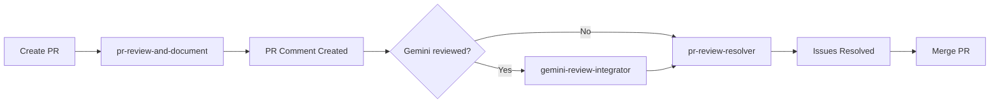

# PR Review Toolkit

[](https://github.com/marxbiotech/pr-review-toolkit/releases)
[](LICENSE)

A Claude Code plugin for comprehensive PR review workflow: execute reviews, integrate Gemini suggestions, and interactively resolve issues.

> **Latest:** See [CHANGELOG.md](CHANGELOG.md) for release notes | [Releases](https://github.com/marxbiotech/pr-review-toolkit/releases) for downloads

## Features

| Skill | Description |
|-------|-------------|
| **pr-review-and-document** | Execute comprehensive PR review using opus model and post structured results as a PR comment |
| **gemini-review-integrator** | Integrate Gemini Code Assist suggestions into the existing PR review comment |
| **pr-review-resolver** | Interactively resolve PR review issues one by one (繁體中文) |

## Prerequisites

- **GitHub CLI** (`gh`) - authenticated and configured
- **pr-review-toolkit plugin (official)** - The agents used by pr-review-and-document skill

Install the official pr-review-toolkit plugin first:
```bash
# In Claude Code
/plugin marketplace add claude-plugins-official
/plugin install pr-review-toolkit
```

## Installation

### From Marketplace (Recommended)

In Claude Code:
```
/plugin marketplace add marxbiotech/pr-review-toolkit
/plugin install pr-review-toolkit
```

### From Source

```bash
# Clone the repository
git clone https://github.com/marxbiotech/pr-review-toolkit.git

# In Claude Code, add the plugin
claude --plugin-dir /path/to/pr-review-toolkit
```

### Codex Plugin / Skills (From Source)

This repository also includes a repo-scoped Codex marketplace at `.agents/plugins/marketplace.json`, a Codex plugin manifest at `.codex-plugin/plugin.json`, and Codex skill definitions under `codex/skills/`:

| Skill | Description |
|-------|-------------|
| **codex-review-pass** | Run a Codex PR review pass and create or update the canonical PR review comment |
| **codex-fix-worker** | Fix one selected PR review issue with a bounded set of owned files; update only that issue's status in the canonical review comment |

Until public Codex marketplace distribution is finalized, install from source by cloning the repository and registering it as a local plugin marketplace in Codex (consult your Codex version's docs for the exact syntax — `codex plugin marketplace add .` is the current recommendation but may change as the Codex CLI's plugin command surface is still evolving; see [Codex's plugin documentation](https://github.com/openai/codex#plugins) <!-- TODO: confirm canonical Codex plugin docs URL before final release --> or run `codex plugin --help` against your installed version). The marketplace entry points at this repo root (`"./"`), and the manifest points Codex at `./codex/skills/`, so keep the repository layout intact:

```bash
git clone https://github.com/marxbiotech/pr-review-toolkit.git
cd pr-review-toolkit
jq empty .agents/plugins/marketplace.json .codex-plugin/plugin.json
# Then register this directory as a local plugin marketplace using the
# subcommand documented for your Codex version (currently expected to be
# `codex plugin marketplace add .`).
```

Set the toolkit root for Codex sessions that run these skills:

```bash
export PR_REVIEW_TOOLKIT_ROOT=/path/to/pr-review-toolkit
```

Both Codex skills use `.pr-review-cache/pr-{N}.json` as the only review state contract and write through the shared `scripts/cache-*.sh` helpers.

**Recommended persistent command approvals for ACP-driven Codex runs:**

ACP approval matching is a literal prefix match against the command Codex executes. Because Codex skills invoke helpers via `${PR_REVIEW_TOOLKIT_ROOT}/scripts/...` (absolute paths derived from the toolkit-root env var), approval entries must match that exact form — not `./scripts/...`.

```text
["$PR_REVIEW_TOOLKIT_ROOT/scripts/get-pr-number.sh"]
["$PR_REVIEW_TOOLKIT_ROOT/scripts/cache-read-comment.sh"]
["$PR_REVIEW_TOOLKIT_ROOT/scripts/cache-write-comment.sh"]
["$PR_REVIEW_TOOLKIT_ROOT/scripts/review-metadata-upgrade.sh"]
["$PR_REVIEW_TOOLKIT_ROOT/scripts/review-metadata-replace.sh"]
["gh", "api"]
["gh", "pr"]
["git", "diff"]
["git", "status"]
```

Avoid broader prefixes like `["bash"]` or `["./"]` that would auto-approve unrelated commands.

## Usage

### PR Review and Document

Run a comprehensive PR review and post it as a comment:

```
Please review this PR and document the results
```

Or more specifically:
- "review PR and save results"
- "run PR review with documentation"
- "create PR review document"

### Gemini Review Integrator

After Gemini Code Assist has reviewed your PR, integrate its suggestions:

```
Integrate Gemini review into the PR comment
```

Or:
- "merge Gemini suggestions"
- "add Gemini comments to PR review"
- "sync Gemini code assist"

### PR Review Resolver

Interactively resolve issues from the PR review comment:

```
處理 PR review 問題
```

Or:
- "修復 review 項目"
- "解決 PR 回饋"
- "逐一處理 review issues"
- "run pr review resolver"

## Workflow


```mermaid
graph LR
    A[Create PR] --> B[pr-review-and-document]
    B --> C[PR Comment Created]
    C --> D{Gemini reviewed?}
    D -->|Yes| E[gemini-review-integrator]
    D -->|No| F[pr-review-resolver]
    E --> F
    F --> G[Issues Resolved]
    G --> H[Merge PR]
```

## PR Comment Structure

The PR review comment includes:

- **Metadata block**: Hidden JSON for tracking review state
- **Summary table**: Issue counts by category (Critical, Important, Suggestions)
- **Issue details**: Collapsible sections with file references and fixes
- **Type design ratings**: Quality scores for new types
- **Action plan**: Before-merge and after-merge checklists

## Status Indicators

| Indicator | Meaning |
|-----------|---------|
| ✅ | Fixed / Resolved |
| ⏭️ | Deferred / Skipped intentionally |
| ⚠️ | Needs attention |
| 🔴 | Blocking / Critical |

## Scripts

The plugin includes shared scripts in `scripts/`:

| Script | Purpose |
|--------|---------|
| `find-review-comment.sh` | Find existing PR review comment by metadata marker |
| `upsert-review-comment.sh` | Create or update PR review comment |
| `fetch-gemini-comments.sh` | Fetch and parse Gemini Code Assist comments |
| `review-metadata-upgrade.sh` | Normalize PR review metadata to schema 1.1 |
| `review-metadata-replace.sh` | Replace the hidden metadata block without changing issue sections |

## License

MIT
